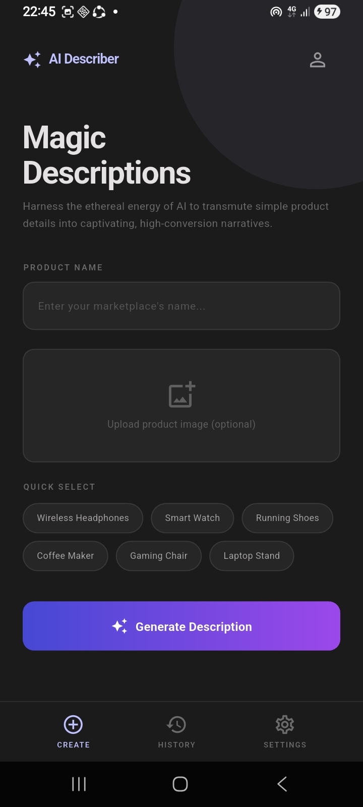
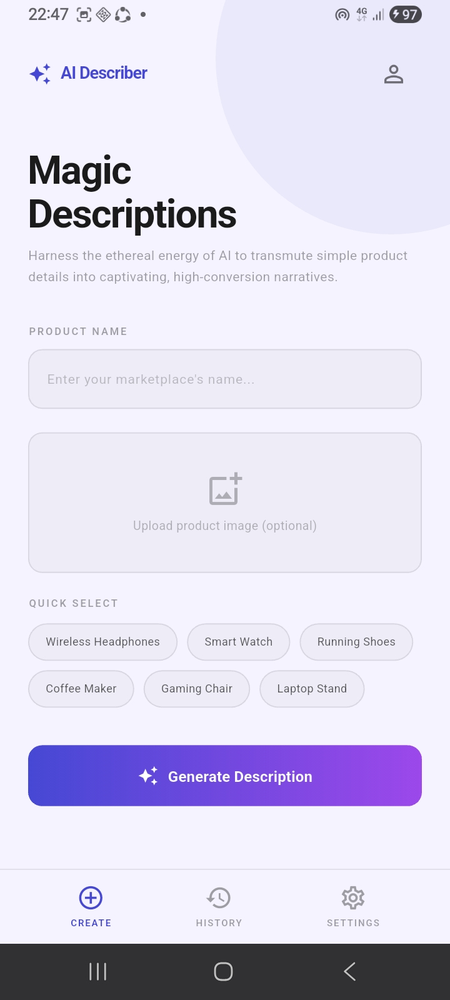
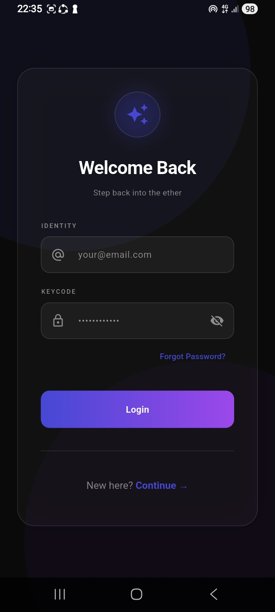
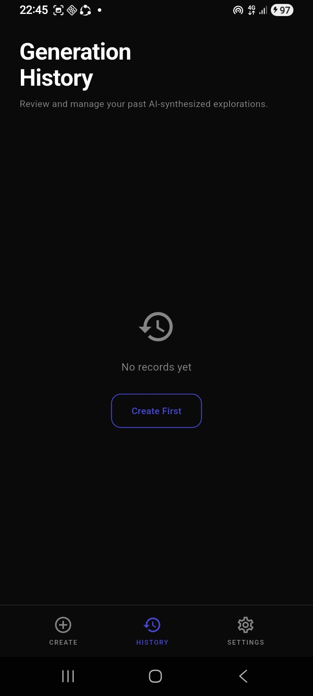
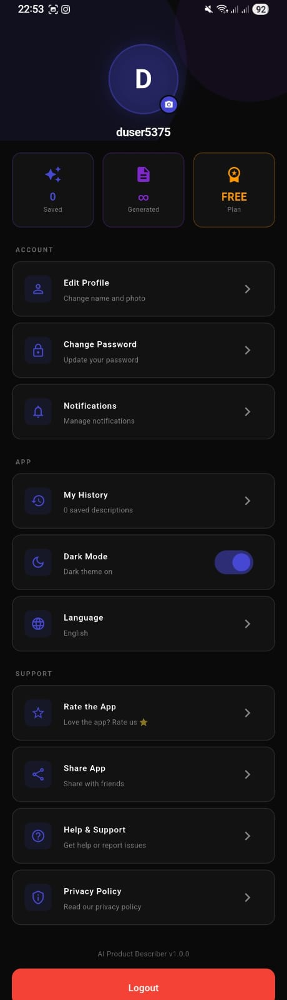

# AI Product Describer

> Generate professional, high-converting product descriptions from a product name or photo — instantly.


---

## Overview

AI Product Describer turns a product name — or just a photo — into a polished, ready-to-publish e-commerce listing for platforms like **Amazon** and **Daraz**. Built with a glassmorphic design system with full dark and light theme support.

---

## 🎨 UI Themes

| Dark Mode | Light Mode |
|:---------:|:----------:|
|  |  |

The application supports both **Dark Mode** and **Light Mode**, with the selected theme automatically saved for future sessions.

---

## 📱 Application Preview

| Login | Home | History | Profile |
|:-----:|:----:|:-------:|:-------:|
|  |  |  |  |

---

## Features

- 🔐 **Firebase Authentication** — secure email/password sign-in and registration
- ✨ **AI-Generated Descriptions** — detailed, e-commerce-ready copy via LLaMA on Groq
- 📸 **Image-to-Description** — point the camera at a product and get a full listing
- 🎭 **Tone Control** — Professional, Casual, Luxury, SEO Focused, Funny
- 💾 **Cloud History** — every generation saved to Firestore per user
- 🌗 **Light / Dark Mode** — glassmorphic theme across all screens, persisted on device
- 📋 **One-Tap Copy & Share** — straight to clipboard or any app
- 👤 **Profile Management** — photo upload, password change, notification preferences

---

## Tech Stack

| Layer | Technology |
|:------|:-----------|
| Framework | Flutter (Dart) |
| Authentication | Firebase Auth |
| Database | Cloud Firestore |
| AI Engine | Groq API — LLaMA 3.3 / 3.2 Vision |
| State Management | Provider |
| Local Storage | SharedPreferences |
| Environment | flutter_dotenv |

---

## Project Structure

```
lib/
├── models/
│   └── product_model.dart
├── screens/
│   ├── splash_screen.dart
│   ├── login_screen.dart
│   ├── home_screen.dart
│   ├── result_screen.dart
│   ├── history_screen.dart
│   └── profile_screen.dart
├── services/
│   ├── ai_service.dart
│   ├── auth_service.dart
│   └── firebase_service.dart
├── theme/
│   ├── app_colors.dart
│   ├── app_theme.dart
│   └── theme_provider.dart
└── widgets/
    └── custom_button.dart
```

---

## Getting Started

```bash
git clone https://github.com/Chenthan006/AI_Product_Describer
cd AI_Product_Describer
flutter pub get
```

**Environment setup:**

1. Copy `.env.example` → `.env`
2. Add your **Groq API key** to `.env`
3. Add `android/app/google-services.json` from your Firebase Console
4. Enable **Email/Password Auth** and **Firestore** in Firebase

```bash
flutter run
```

---

## Roadmap

- [ ] Google Play Store release
- [ ] Account deletion & data export
- [ ] Multi-language description output
- [ ] PDF export for product catalogs

---

## License

Copyright © 2026 **D. Chenthan**. All rights reserved.

This project — including its source code, UI design, and concept — is the original work of D. Chenthan.  
Unauthorized copying, redistribution, or commercial use without written permission is prohibited.

---

<div align="center">

**Built by D. Chenthan**

Software Engineering Undergraduate · NSBM Green University · Sri Lanka 🇱🇰

[](https://www.linkedin.com/in/d-chenthan-25018535b)
[](https://github.com/Chenthan006)

</div> 